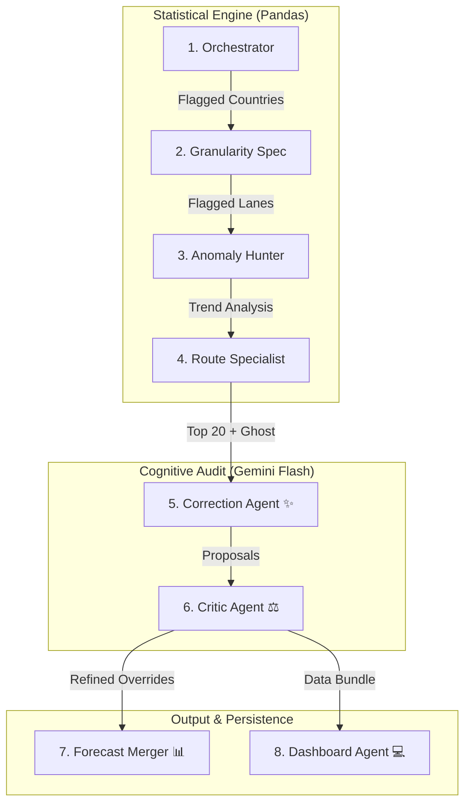

# 🚛 Logistics Forecast Analysis Swarm v2

[](https://www.python.org/)
[](https://pandas.pydata.org/)
[](https://ai.google.dev/)

A sophisticated 8-agent pipeline designed to automate the auditing of EU logistics forecasts. This system identifies anomalies using statistical Z-Scores, validates them against 2-year historical actuals, and leverages Generative AI for structured overrides and interactive reporting.

---

## 🏗️ Swarm Architecture (8 Agents)

The v2 Swarm uses a multi-layered verification strategy where results are audited and refined before being finalized.



---

## 📂 Project Structure

```text
.
├── actuals/                # 2-year historical shipping volumes
│   └── historical_actuals.xlsx
├── forecasts/              # Raw and processed forecast exports
│   ├── weekly_forecast_data.xlsx
│   └── weekly_forecast_data_overrides.xlsx  # Final output
├── main_swarm.py           # Core 8-agent logic 🛡️
├── dummy_fcst_generator.py # Data generator with seasonality logic 🧪
├── dashboard_template.html # Interactive UI source 🎨
├── requirements.txt        # Python dependencies
└── .env                    # Local credentials (IGNORED)
```

---

## 👥 The Agents

1.  **Orchestrator**: Country-level Z-Score analysis to identify regional shifts.
2.  **Granularity Specialist**: Drill-down to Country × Lane Type to find specific modality issues.
3.  **Anomaly Hunter**: Computes WMAPE bias and YoY seasonality benchmarks from 2-year history.
4.  **Route Specialist**: Identifies Top 20 impact routes and detects "Ghost Routes" (forecasts without actuals).
5.  **Correction Agent (Gemini)**: Generates structured overrides with analytical justifications.
6.  **Critic Agent (Gemini)**: Challenges the Correction Agent's output, adjusting confidence scores.
7.  **Forecast Merger**: Stamps overrides directly into a new Excel export for operation use.
8.  **Dashboard Agent**: Injects analysis data into the HTML template for high-level review.

---

## 🚀 Getting Started

### 📋 Prerequisites

```bash
pip install -r requirements.txt
```

### 🧪 Generating Data
The new generator produces **wide-format Excel files** with 2 years of weekly history and realistic seasonality:
```bash
python dummy_fcst_generator.py
```

### 🔑 Configuration
Create a `.env` file in the root:
```text
GEMINI_API_KEY=your_key_here
```

### 🏃 Running the Swarm
```bash
python main_swarm.py
```

---

## 📊 Outputs
- **Interactive Dashboard**: `forecast_quality_dashboard.html` for visualizing bias and trends.
- **Excel Overrides**: `forecasts/weekly_forecast_data_overrides.xlsx` with new `override_volume` columns.
- **Human Review**: `flagged_for_review.json` containing low-confidence overrides for manual audit.
