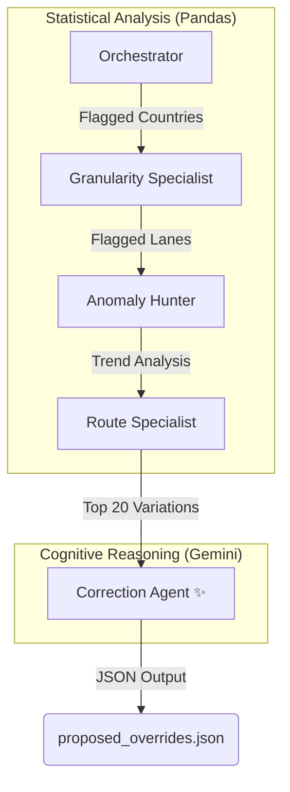

# 🚛 Logistics Forecast Analysis Swarm

[](https://www.python.org/)
[](https://pandas.pydata.org/)
[](https://ai.google.dev/)

A sophisticated multi-agent pipeline designed to automate the detection of logistics forecast deviations. This "swarm" identifies anomalies at the country and lane levels, compares them against historical actuals, and leverages Generative AI to propose data-driven volume overrides with underlying justifications.

---

## 🏗️ Swarm Architecture

The pipeline is structured as a series of specialized agents, each focused on a specific layer of the data hierarchy. This approach ensures that the "cognitive" cost (LLM calls) is reserved only for the final reasoning step, while statistical heavy lifting is handled by efficient data processing libraries.



---

## 📂 Project Structure

```text
.
├── actuals/                # Directory for historical actuals CSVs
│   └── recent_actuals.csv  # Ground-truth shipping volumes
├── forecasts/              # Directory for raw forecast data
│   └── weekly_forecast_data.csv 
├── main_swarm.py           # The core multi-agent logic 🛡️
├── dummy_fcst_generator.py # Synthetic data generator for testing 🧪
├── requirements.txt        # Project dependencies
└── proposed_overrides.json # Generated results (post-run)
```

---

## 👥 The Agents

1.  **Orchestrator**: Ingests the weekly forecast from `forecasts/`, pivots volume by country, and flags variations > 2%. 
2.  **Granularity Specialist**: Drills down into `modality` and `lane_type` for flagged countries, identifying slices with > 5% deviation.
3.  **Anomaly Hunter**: Performs reality checks by comparing forecasts against historical actuals from `actuals/`.
4.  **Route Specialist**: Filters down to the Top 20 impact routes by absolute volume difference.
5.  **Correction Agent (Gemini)**: The AI "brain" that reviews the top anomalies and generates a `proposed_overrides.json` file with reasoned adjustments.

---

## 🚀 Getting Started

### 📋 Prerequisites

Ensure you have Python 3.8+ installed and the necessary dependencies:

```bash
pip install -r requirements.txt
```

### 🧪 Generating Test Data (Optional)

If you need to regenerate the test datasets with synthetic anomalies (such as the German Rail spike or Air lane reality gaps), run:

```bash
python dummy_fcst_generator.py
```
*Note: The generator creates files in the root; you may need to move them to `/forecasts/` and `/actuals/` as required by the script.*

### 🔑 API Configuration

The swarm requires a Google Gemini API key for the final Correction Agent. You can obtain one at [Google AI Studio](https://aistudio.google.com/).

#### Windows (CMD)
```cmd
set GEMINI_API_KEY=your_api_key_here
```

#### Windows (PowerShell)
```powershell
$env:GEMINI_API_KEY="your_api_key_here"
```

### 🏃 Running the Swarm

Simply execute the main orchestration script:

```bash
python main_swarm.py
```

---

## 📊 Outputs

- **Console Logs**: Real-time progress tracking of each agent's analysis.
- **proposed_overrides.json**: A machine-readable list of corrections including:
    - `route`: The specific origin-destination lane.
    - `proposed_volume`: The data-driven volume correction.
    - `justification`: The AI's analytical reasoning based on historical trends.

---

> [!TIP]
> This system is designed to be **"frugal by design"**. By filtering millions of rows down to just the top 20 critical anomalies using Pandas before involving the LLM, we ensure maximum accuracy at near-zero API cost.
